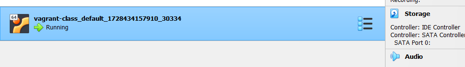

# Lab Guide Screenshots Below:
## 1. The image below shows the virtual machine in its running state after running vagrant up

## 2. Screenshot of ssh into the machine

## 3. Screenshot shutting down the VM using vagrant destroy

## Spinning up two VM separately, apache and nginx webserver

4. Screenshot of apache default page 

5. Screenshot of edited apache default page

6. Screenshot of nginx default page 

7. Screenshot of edited nginx default page

8. Screenshot of apache and nginx VM running

